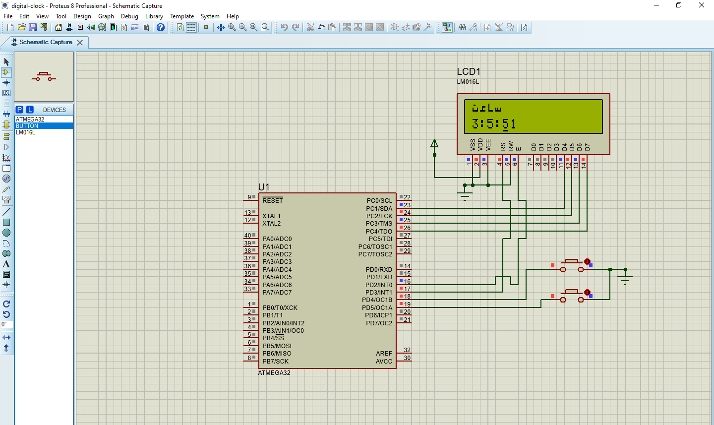

# Digital Clock Project

This project implements a simple digital clock using a microcontroller and an LCD display.

## Hardware Requirements

- Microcontroller: ATmega32
- Crystal Oscillator: 8MHz
- LCD: 16x2 character display
- Push Buttons: For setting hours and minutes

## Circuit Diagram

## Usage

1. Connect the hardware components according to the circuit diagram.
2. Upload the provided code (`code.bas`) to the microcontroller.
3. Power on the circuit.
4. The clock will start displaying the current time.
5. Press the buttons to adjust the hours and minutes.

## Files

- `code.bas`: The BASIC code for the digital clock.
- `circuit_diagram.png`: Circuit diagram image.

## Contributing

Pull requests are welcome. For major changes, please open an issue first to discuss what you would like to change.

