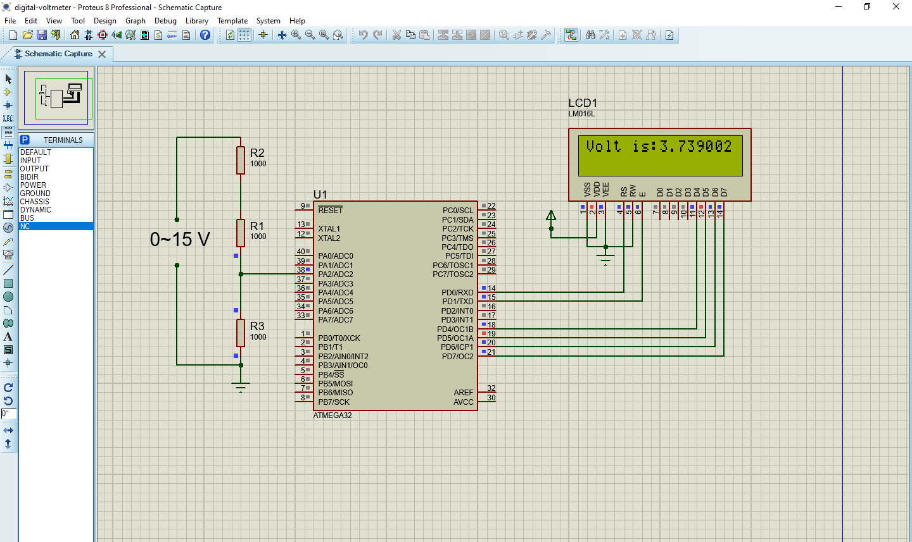

# Simple Digital Voltmeter using Atmega32

This project demonstrates a simple digital voltmeter using Atmega32 microcontroller and 3 resistors. The microcontroller reads the analog voltage input from a sensor and displays the corresponding voltage value on an LCD screen.

## Components Used
- Atmega32 microcontroller
- LCD display
- Resistors
- Potentiometer (for voltage division)
- Power supply (typically 5V)

## Circuit Diagram

## How it Works
- The analog voltage input is connected to one of the ADC channels of the Atmega32 microcontroller.
- The voltage is divided using a simple voltage divider circuit consisting of resistors.
- The microcontroller reads the analog voltage using its built-in ADC.
- The digital value obtained from ADC is converted into voltage using a simple conversion formula.
- The voltage value is displayed on the LCD screen in real-time.

## Getting Started
1. Connect the components as per the circuit diagram.
2. Program the Atmega32 microcontroller with the provided code using an AVR programmer.
3. Power up the circuit.
4. The LCD will display the voltage reading in real-time.

## Code Explanation
- The code is written in BASCOM-AVR language.
- It configures the ADC to read analog input from a specified channel.
- It continuously reads the analog voltage, converts it to a voltage value, and displays it on the LCD.

## Author
- [Atilla Asghari](https://github.com/atillaasghari)

