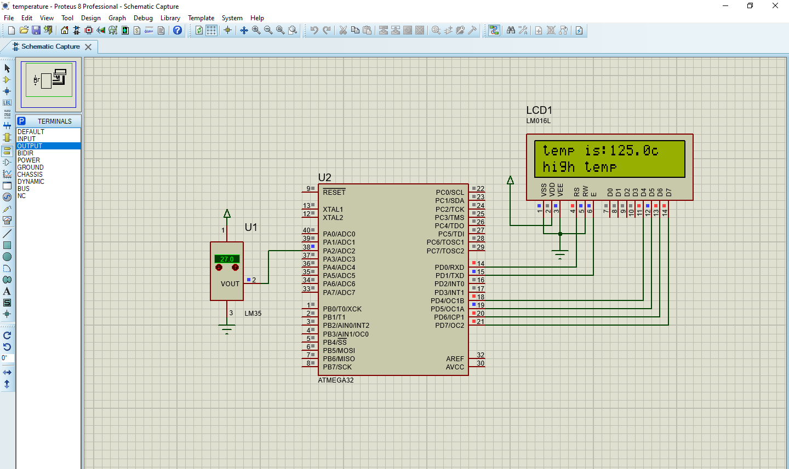

# Temperature Monitoring System

This is an electronic project implemented using BASCOM language and simulated in Proteus. It measures temperature using an analog temperature sensor connected to an ADC channel of a microcontroller. The temperature readings are displayed on an LCD screen, and the system also alerts if the temperature exceeds predefined thresholds.

## Features

- Measures temperature using ADC
- Displays temperature readings on an LCD screen
- Alerts for high and low temperatures
- Easy to set up and modify for different microcontroller configurations

## Requirements

- BASCOM compiler
- Proteus simulation environment

## Usage

1. Open the project in BASCOM compiler.
2. Compile and upload the code to your microcontroller.
3. Set up the Proteus simulation environment.
4. Simulate the project in Proteus.

## Circuit Diagram

## Code Explanation

- `Config` statements: Configure microcontroller pins, ADC, and LCD.
- `Start Adc`: Start the ADC.
- Reading ADC value: Read temperature sensor output from ADC channel.
- Calculating temperature: Convert ADC value to temperature in Celsius.
- Displaying temperature: Display temperature on LCD.
- Temperature threshold check: Display "High Temp" or "Low Temp" if temperature exceeds predefined thresholds.

## Contributing

Pull requests are welcome. For major changes, please open an issue first to discuss what you would like to change.

Please make sure to update tests as appropriate.

